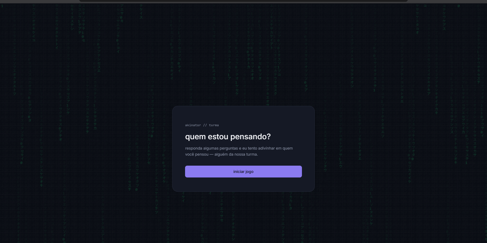
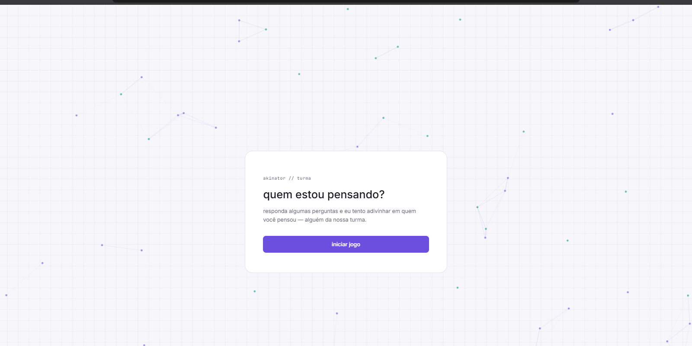

# 🎮 Akinator da Turma

> Um Akinator-style guessing game feito sob medida pra uma turma real — responda perguntas e descubra em quem a IA está pensando.


---

## 📺 Demonstração

<table>
  <tr>
    <th>Tema escuro</th>
    <th>Tema claro</th>
  </tr>
  <tr>
    <td>
      
    </td>
    <td>
      
    </td>
  </tr>
</table>

---

## 📖 Sobre o projeto

O **Akinator da Turma** é a versão front-end de um jogo inspirado no clássico Akinator, só que em vez de personagens famosos, quem está no banco de dados são as pessoas de uma turma de verdade. O usuário responde perguntas de sim/não e, a cada resposta, o motor do jogo (no back-end) vai eliminando candidatos até sobrar um só — ou até descobrir que ninguém bateu com as respostas, o que também conta como vitória.

Esse repositório contém **só o front-end**: HTML, CSS e JavaScript puro, sem framework e sem bundler, consumindo a API do back-end via `fetch`.

> 🔗 O back-end (Spring Boot + PostgreSQL) vive em um repositório separado: [`akinator-turma-backend`](https://github.com/gustavomiranda-dev/akinator-turma-backend)

---

## ✨ Funcionalidades

- **4 telas de jogo** — início, pergunta, resultado e "não descobriu" (tratado como vitória do jogador)
- **Tema claro e escuro**, com preferência salva em `localStorage`
- **Fundo animado exclusivo por tema:**
  - 🌑 Escuro → chuva de caracteres estilo *hacker*
  - ☀️ Claro → grafo de nós conectados (roxo/teal), remetendo à ideia de "conectar pistas"
- **Música ambiente opcional**, com botão de ativar/desativar e estado persistido
- **Identidade visual própria** — paleta dark tech com acento roxo e teal, tipografia mono + sans
- Totalmente **responsivo**, sem dependências externas de JS

---

## 🛠️ Tecnologias utilizadas

- **HTML5** semântico
- **CSS3** — variáveis CSS para tematização, sem pré-processador
- **JavaScript (Vanilla)** — sem framework, sem bundler
- **Canvas API** — para os efeitos de fundo animados
- **Google Fonts** — Inter (texto) e JetBrains Mono (elementos técnicos/HUD)

---

## 📁 Estrutura do projeto

```
akinator-turma-frontend/
├── index.html          # Estrutura das 4 telas do jogo
├── style.css            # Estilos, temas (claro/escuro) e responsividade
├── script.js             # Lógica do jogo: fetch na API, transições de tela
├── matrix-bg.js          # Efeito de fundo do tema escuro
├── nodes-bg.js            # Efeito de fundo do tema claro
├── musica.js               # Controle do player de música ambiente
├── images/                  # Fotos das pessoas (não versionado — ver .gitignore)
└── audio/                    # Trilha de fundo
```

---

## 🚀 Como rodar localmente

### Pré-requisitos

- O [back-end do projeto](#) rodando em `http://localhost:8080` (ou ajustar `API_BASE_URL` em `script.js`)
- Um navegador moderno — não precisa de Node, servidor ou build

### Passo a passo

```bash
# clone o repositório
git clone https://github.com/gustavomiranda-dev/akinator-turma-frontend.git

# entre na pasta
cd akinator-turma-frontend

# adicione as fotos em images/ 
# (as fotos não vêm versionadas — ver seção abaixo)

# abra o index.html no navegador
# (ou sirva com uma extensão tipo Live Server, se preferir)
```

> ⚠️ A pasta `images/` estão no `.gitignore` propositalmente — fotos reais de pessoas  não são versionadas. Elas precisam ser adicionadas manualmente antes de rodar o projeto.

---

## 🎨 Identidade visual

| Elemento | Escolha |
|---|---|
| Paleta | Dark tech (fundo quase-preto) + acento roxo e teal |
| Tipografia | Inter (texto) + JetBrains Mono (HUD/labels) |
| Tom | Gamificação discreta, sem exagero infantil |

---

## 👤 Autor

**Gustavo Miranda**
[GitHub](https://github.com/gustavomiranda-dev)

---

## 📄 Licença

Este projeto está sob a licença MIT — veja o arquivo [LICENSE](./LICENSE) para mais detalhes.
